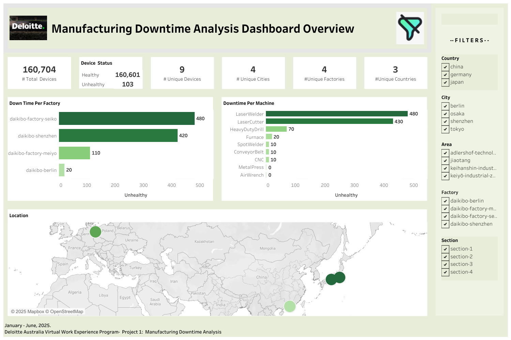

# Manufacturing-Downtime-Analysis

## Overview
This project focuses on analyzing downtime trends at **Daikibo Manufacturing Company**, highlighting inefficiencies across factories, locations, and machine types.  
Key findings showed that the **Seiko factory** and the **Laser Welder machine** were the most critical downtime drivers.
## The Problem
- The manufacturing process faced recurring downtime, creating production bottlenecks.  
- The **Seiko factory** recorded the highest downtime (**480 units**).  
- The **Laser Welder machine** also showed **480 downtime units**, significantly impacting efficiency.
## Insights
- Downtime was concentrated in specific factories and machines, with **Seiko + Laser Welder** being the top contributors.  
- Trends visualized through dashboards highlighted clear patterns of operational inefficiencies.
## Recommendations
- Implement **downtime readiness and recovery plans** for high-risk machines (e.g., Laser Welder).  
- Introduce **proactive monitoring systems** to detect issues before downtime escalates.  
- Prioritize maintenance and process optimization at the **Seiko factory** to reduce bottlenecks.  
##  Technologies & Skills Used
- **SQL** – Extracted and analyzed downtime data  
- **Tableau** – Built interactive dashboards to visualize factory & machine trends  
- **Data Analysis** – Identified inefficiencies across production sites  
- **Dashboard Development** – Created clear, decision-focused visualizations  
- **Data Storytelling** – Presented findings and recommendations in a business-oriented manner  

## 📷 Dashboard Preview
*(Add a screenshot of your Tableau dashboard here if available)* 

## 🚀 Key Takeaway
By uncovering the **Seiko factory** and **Laser Welder machine** as major downtime drivers, this project proposed actionable strategies to minimize production disruptions and improve workflow efficiency.
